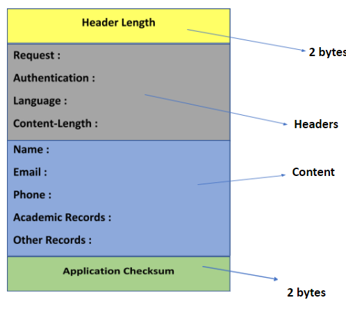

# Record Fetcher

This is a simple tool that uses UDP sockets to connect with the server and fetch data of a office bearer. The data is stored in MongoDB database. 

# Protocol Design




## Instructions

Clone this repository on your local system. Navigate to the engine folder 
```
cd engine
```

and run the commands in your favourite terminal to install all the dependencies

```
pip install -r requirements.txt
```
To run this project, inside the engine folder run the command in your terminal.

```
python server.py
```
Then navigate back to the main directory 
```
cd ..
```
and run these commands in your terminal

```
npm install
npm start
```

## License
This project is distributed under [MIT License]
Your feedback, ideas, suggestions are most welcomed.
